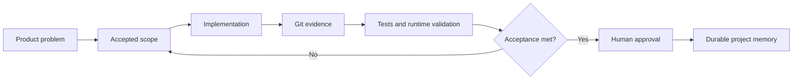

# Károly Henrik Darázsi

### iOS developer building products — and the engineering systems that make them reliable.

SwiftUI · Apple platforms · product engineering · automation · evidence-driven delivery

---

I build **GlassBox**, an independent iPhone productivity and self-care product, and the engineering system around it: scoped delivery, validation evidence, durable project memory, review-gated automation, and production-tested infrastructure.

My background in broadband critical communications, provisioning, Linux systems, device troubleshooting, and automation shapes how I approach software: investigate carefully, keep responsibilities explicit, validate real behavior, and document decisions so the work remains maintainable.

> **GlassBox is the product. The surrounding workflow, automation, project memory, and homelab show how I turn ideas into controlled, testable, and reviewable technical work.**

## Proof of work

| Project | What it demonstrates | Current state |
| --- | --- | --- |
| [**GlassBox**](https://github.com/Charles-drZ/glassbox-showcase) | Independent iPhone product ownership across product shaping, SwiftUI development, persistence, Apple-platform integrations, testing, and release preparation. The application source remains private. | TestFlight validation and App Store readiness |
| [**Raspberry Home**](https://github.com/Charles-drZ/raspberry-home-showcase) | Versioned Home Assistant UI, Docker operations, guarded deployment, backup, configuration validation, rollback, CI, and desktop/iOS runtime acceptance. | Production-validated v1 on a real Raspberry Pi 5 |
| [**Development workflow**](https://github.com/Charles-drZ/glassbox-development-workflow) | Evidence-driven product delivery using explicit scope, Git history, runtime validation, durable memory, AI assistance, and human decision authority. | Active working model |
| [**Automation workflow**](https://github.com/Charles-drZ/automation-workflow-showcase) | n8n-based evidence collection and review-gated project-memory synchronization without treating automated summaries as final truth. | Evolving private workflow with a sanitized public case study |

## Current technical focus

- Preparing GlassBox for release through TestFlight, regression testing, persistence and restore validation, and App Store readiness work.
- Building SwiftUI features with careful state, persistence, localization, and Apple-platform integration boundaries.
- Developing deterministic, review-gated n8n workflows that connect issue tracking, Git evidence, and durable project memory.
- Extending a Raspberry Pi 5 and Home Assistant platform through versioned UI work, safe operations, runtime evidence, and privacy-aware documentation.
- Growing toward an iOS engineering role where product thinking, reliability, and disciplined delivery matter alongside implementation.

## Technical scope

### Apple product development

Swift · SwiftUI · SwiftData · CloudKit · StoreKit 2 · HealthKit · Sign in with Apple · XCTest · Xcode · TestFlight · localization

### Quality and validation

Unit testing · physical-device testing · manual and regression testing · issue reproduction · persistence and restore checks · runtime validation · log-based troubleshooting · release-readiness review

### Engineering workflow and automation

Git · GitHub · GitHub Actions · Linear · n8n · OpenAI API · ChatGPT · Codex · Obsidian / Markdown · Python · Bash · YAML · JSON

### Systems and technical operations

Linux · Docker · Raspberry Pi 5 · Home Assistant · Pi-hole · Tailscale · networking · Wireshark / PCAP analysis · MDM · provisioning systems · SOAP / XML services · SQL

## How I work

AI tools can support investigation, implementation, and structured processing, but they do not replace product decisions, privacy review, runtime acceptance, or final responsibility.

## Professional background

I work in broadband critical communications, contributing to provisioning, system integration, device-side technical work, MDM, Linux-based troubleshooting, internal technical documentation, and automation. This environment has strengthened my habits around evidence, rollback thinking, repeatable procedures, and clear technical handover.

## Public portfolio boundary

- GlassBox source code, private implementation details, internal identifiers, product logic, and unreleased assets are not published.
- Public repositories contain independently written case studies, sanitized architecture, and verified outcomes rather than cleaned copies of private repositories.
- Screenshots and workflow visuals are added incrementally only after the relevant UI is stable and has passed explicit privacy review.
- Real credentials, network details, personal data, private issue content, raw logs, and deployable private workflow configuration remain private.

## Contact

- [LinkedIn](https://linkedin.com/in/charles-drzs)
- [GitHub](https://github.com/Charles-drZ)
- App Store link will be added after public release.

Technical profile last reviewed: July 2026.
